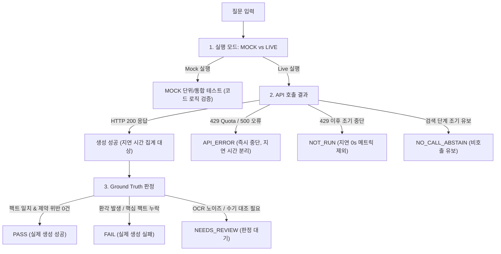

# CampusMate 평가 기준선 및 데이터 계약 명세 (R0 개정판)

본 문서는 CampusMate 프로젝트의 R0(기존 결함 수정 및 평가 기준 확정) 검수 피드백을 반영하여 개정된 산출물로서,
RAG 질의 평가 체계, 일정 추출 합성 픽스처 기준, 다차원 평가 상태 보고 원칙, 그리고 후속 R1(인증/개인 일정 API) 구현을 위한 데이터 계약 초안을 정의한다.

> [!IMPORTANT]
> **실측 데이터 및 로컬 근거 원칙:**
> 1. 실제로 측정하지 않은 수치(예: 측정되지 않은 지연 시간, 가짜 정답률)는 일절 기재하지 않는다.
> 2. 평가 기준선의 모든 정답 주장은 로컬 저장소의 `data/unified_campus_knowledge.json` 파일의 실제 내용과 일치해야 하며, 확인되지 않은 규정이나 편집 이력을 추측하지 않는다.
> 3. 기준 데이터셋 해시: `SHA-256: c6969ec41faa332b660186cf5407f07dc9621fcbccd2158e124e9b62c225359e` (`data/unified_campus_knowledge.json`, 1,366건, 4,782,727 bytes)

---

## 1. 핵심 RAG 평가 30~50문항 분류표 및 초기 대표 사례 10개

### 1.1 5대 도메인 및 특수 상황 분류표 (Taxonomy)

향후 30~50문항 규모로 확대할 RAG 평가 데이터셋의 분류 체계는 학내 5대 핵심 주제와 5대 예외/경계 상황을 포괄한다.

| 분류 ID | 분류명 | 포함 내용 및 테스트 목적 | 목표 문항 수 |
|---|---|---|---|
| **CAT-01** | 수강신청 / 학사일정 | 정규 수강신청, 수강정정(1·2차), 학점포기, 계절학기, 재수강 기준 | 4~6 |
| **CAT-02** | 장학금 / 등록금 | 국가장학금(1·2차), 가구원 동의, 교내 장학금, 푸른등대, 등록금 분할납부 | 5~7 |
| **CAT-03** | 졸업 / 학위 / 다전공 | 졸업요건, 학사학위취득유예(졸업유예), 전공심화, 다전공(복수/부/트랙) | 4~6 |
| **CAT-04** | 휴복학 / 제적 / 전과 | 일반휴학, 군휴학, 복학 신청 절차, 일반전부(과), 자퇴 및 재입학 | 4~5 |
| **CAT-05** | 시설 / 학생복지 / IT | 상상파크·코딩라운지 대여, 중앙도서관 좌석/대출, 교내 Wi-Fi(무선랜), 헬스장 | 4~5 |
| **CAT-06** | 고유 약어 / 전문용어 | TOPCIT 정기평가, IPP 장기현장실습, CAP 프로그램, 비교과 상상마일리지 | 3~4 |
| **CAT-07** | 과거 연도 / 시점 앵커 | 특정 연도(예: 2024년) 지정 질의 시 최신 연도(2026년) 공지로 대체하지 않고 해당 연도 문서 회수 | 3~4 |
| **CAT-08** | 정정 공지 / 시점 충돌 | 제목-본문 날짜 충돌, 마감 연장 공지, 동일 게시일 정정본의 최신 확인 시각 반영 | 3~4 |
| **CAT-09** | 본문 미확보 (title_only) | 첨부/이미지 미추출 문서에 대해 허위 세부 내용을 지어내지 않고 원문 확인 안내 제공 | 3~4 |
| **CAT-10** | 범위 밖 / 무관 질의 | 일반 프로그래밍 코드 작성, 기기 스펙 등 학내 무관 질의에 대한 조기 유보(no_context) | 3~4 |
| **합계** | **전체 10개 영역** | **학내 핵심 학사 정보 및 강건성 검증** | **36~49문항** |

---

### 1.2 초기 대표 사례 10개 (로컬 데이터 전수 대조 결과)

- **검증 데이터 파일:** `data/unified_campus_knowledge.json`
- **파일 SHA-256:** `c6969ec41faa332b660186cf5407f07dc9621fcbccd2158e124e9b62c225359e`
- **원문 발췌 검증 및 공백 정규화 규칙 (Normalization Rule):**
  1. 모든 발췌문(`quotes`)은 문서의 제목(`title`) 및 본문(`content`)에 실제로 존재하는 연속된 부분 문자열(exact substring)이거나, 공백 정규화(연속된 줄바꿈·탭·공백 `\s+` 및 비분리 공백 `\xa0`를 단일 공백 `' '`으로 치환하고 앞뒤 공백 제거) 후 완전 일치하는 부분 문자열이다.
  2. 원문에 없는 임의의 생략 부호(`...`)나 여러 문장의 인위적 이어붙이기는 발췌에서 배제하며, 복합 문맥은 개별 발췌 목록으로 분리한다.
  3. 재작성된 내용은 '요약(Summary)'으로 명확히 구분 표기한다.
- 로컬 데이터에 근거가 존재하지 않는 항목은 **'평가 준비 미완료'**로 명확히 표시하며 가짜 사실이나 가짜 URL을 생성하지 않는다.

#### 사례 1: [CAT-01 수강] 수강신청 일정 및 정정 방법
- **질문:** 수강신청 일정과 수강신청 후 정정 방법이 어떻게 돼?
- **문서 ID:** `a13e7f186a30adc9b2f7883f02679e58a49e74b805e80d0320a7e709bb3fc93d`
- **근거 URL:** `https://www.hansung.ac.kr/hansung/6225/subview.do` (상시안내 「수강신청」)
- **문서 제목:** `수강신청`
- **정확한 원문 발췌 (Quotes):**
  - `"매학기 개강전 (2월, 8월 중순)"`
  - `"한성대학교 종합정보시스템 > 교무 > 수강신청"`
  - `"수강신청 후 종합정보시스템 > 교무 > 수강신청서를 통해 확인 가능"`
  - `"2차 수강신청 정정기간 및 수강신청 포기기간 이후에는 반드시 수강 신청 내역을 확인 해야 함"`
- **요약 (Summary):** 2월·8월 중순 개강 전 수강신청 진행, 종합정보시스템 > 교무 > 수강신청 경로 이용, 2차 정정/포기기간 후 최종 내역 확인 필수.
- **판정 기준:** 일정(2월, 8월 중순 개강 전), 신청 경로(종합정보시스템 > 교무 > 수강신청), 2차 정정/포기기간 후 최종 내역 확인 필수 안내 시 PASS.
- **로컬 근거 확인:** **확인 완료** (`content_status: text`)

#### 사례 2: [CAT-02 장학] 국가장학금 2차 신청 마감일과 서류제출/가구원동의 마감일 구분
- **질문:** 2026년 2학기 국가장학금 2차 신청 마감일이랑 가구원 동의 마감일이 같아?
- **문서 ID:** `bdda8c56bb23a38e3266b27b5901e2a043b4db2cb37bc3748666a8fe7271e9d4`
- **근거 URL:** `https://www.hansung.ac.kr/bbs/hansung/2127/223971/artclView.do` (공지 「국가장학금\n2026년 2학기 국가장학금 2차 신청 안내」)
- **문서 제목:** `국가장학금\n2026년 2학기 국가장학금 2차 신청 안내`
- **정확한 원문 발췌 (Quotes - 포스터 OCR 본문 분리 목록):**
  - `"'26.8.12.(수) 09시~9.9.(수) 18시"`
  - `"서류제출 및 가구원 동의"`
  - `"26.8.12.(수) 09시~9.16.(수) 184]"`
- **요약 (Summary):** 신청 기간은 8.12 ~ 9.9 18시이며, 서류제출 및 가구원 동의 기간은 8.12 ~ 9.16 18시(추정)까지로 상이함.
- **판정 기준 (확정 평가와 검수 보류의 분리):**
  1. **확정 채점 기준 (PASS/FAIL):** 신청 마감일(9월 9일)과 서류제출/가구원 동의 마감일(9월 16일)의 일자가 서로 다름을 명시해야 함. 두 마감일이 같다고 답하면 FAIL.
  2. **채점 보류 항목 (NEEDS_REVIEW):** 본문 OCR 추출 시 서류제출 마감 시각이 `'184]'`로 오인식되어 있음(포스터 원본의 '18시'로 추정되나 이미지 미검수 상태). 원문 이미지 수기 대조 전까지 구체적 마감 시각('18시 정각' 등)의 엄격 일치 여부는 기계적 확정 채점에서 제외하거나 `NEEDS_REVIEW`로 관리함.
- **로컬 근거 확인 및 OCR 검수 메모:** **확인 완료 (시각 채점 보류: NEEDS_REVIEW)**

#### 사례 3: [CAT-03 졸업] 학사학위취득유예(졸업유예) 신청 요건 및 대상
- **질문:** 학사학위취득유예(졸업유예) 신청 자격이 어떻게 되나요?
- **문서 ID:** `f16516639046a6dbcf85d538fdada707cfa4ee3e84a249b4b44303e76a018fcd`
- **근거 URL:** `https://www.hansung.ac.kr/hansung/6237/subview.do` (상시안내 「졸업유예(학사학위취득유예)」)
- **문서 제목:** `졸업유예(학사학위취득유예)`
- **정확한 원문 발췌 (Quotes):**
  - `"유예 신청자격은 신청하는 학기에 8학기 이상 등록하고 졸업학점과 전공 졸업요건을 모두 충족 예정인 학생이어야 함. 단, 외국인 유학생은 유예신청을 할 수 없음."`
  - `"수료자, 조기졸업 신청자, 외국인유학생은 졸업유예 신청 불가 / 편입생은 졸업유예 신청 가능"`
  - `"유예 신청은 학기 단위로 신청하면 최대 2개 학기(1년)까지 신청/승인 가능함."`
- **요약 (Summary):** 8학기 이상 등록 및 전공/졸업요건 충족 예정자 대상, 최대 2학기(1년) 가능. 외국인 유학생/수료자/조기졸업 신청자는 불가하며 편입생은 가능.
- **판정 기준 (필수 제약):**
  1. 신청 학기에 8학기 이상 등록하고 졸업 요건(학점 및 전공요건)을 모두 충족 예정인 학생
  2. 신청 기간: 학기 단위로 최대 2개 학기(1년)까지 가능
  3. **제외 제약 (필수): 외국인 유학생, 수료자, 조기졸업 신청자는 신청 불가.** (편입생은 신청 가능)
  *(원문에 없는 건축학부 10학기 등의 미확인 조건은 정답표에서 완전 배제)*
- **로컬 근거 확인:** **확인 완료** (`content_status: text`)

#### 사례 4: [CAT-04 휴복학] 일반휴학 신청 기간 및 통산 한도
- **질문:** 일반휴학은 한 번에 몇 학기까지 가능하고 통산 몇 학기까지 휴학할 수 있어?
- **문서 ID:** `57ff96ebbafdcc71acea368b70bcf6a6a304f4207718dfefd7c92ce75b12fb7b`
- **근거 URL:** `https://www.hansung.ac.kr/hansung/6248/subview.do` (상시안내 「휴학」)
- **문서 제목:** `휴학`
- **정확한 원문 발췌 (Quotes - 공백 정규화 적용):**
  - `"휴학은 재학기간중 통산"`
  - `"3년(6학기) 가능(군휴학기간 제외)하며"`
  - `"1회에 1학기, 혹은 2학기 휴학할 수 있다."`
  - `"신입생 은 병역 또는 질병에 의한 경우 이외에는 입학 년도의 휴학을 할 수 없다."` *(원문 개행: `'신입생\n은 병역 또는 질병에 의한 경우 이외에는\n입학 년도의 휴학을 할 수 없다.'`)*
- **요약 (Summary):** 1회당 1학기 또는 2학기 신청 가능, 재학 중 통산 3년(6학기, 군휴학 제외) 한도, 신입생은 첫해 원칙적 휴학 불가(병역/질병 예외).
- **판정 기준:** 1회에 1학기 또는 2학기 가능, 재학기간 통산 3년(6학기) 가능(군휴학 제외) 안내 시 PASS.
  *(원문에 없는 '편입생 3개 학기 제한' 등의 미확인 규정은 정답표에 포함하지 않음)*
- **로컬 근거 확인:** **확인 완료** (`content_status: text`)

#### 사례 5: [CAT-05 시설] 상상파크 및 코딩라운지 이용 예약 방법
- **질문:** 상상파크 기자재와 코딩라운지 세미나실은 어떻게 예약하고 이용시간이 어떻게 돼?
- **문서 ID:** `002c45a581276fc882ccebe30204c976f2cac668efbd727ba16ac05672a2564f` *(상상파크·상상파크플러스·코딩라운지 전용 FAQ)*
- **근거 URL:** `https://www.hansung.ac.kr/bbs/hansung/2148/artclList.do?page=1`
- **문서 제목:** `시설·기자재이용 상상파크·상상파크플러스·코딩라운지는 어떻게 이용하나요?`
- **정확한 원문 발췌 (Quotes):**
  - `"상상파크 기자재 및 상상파크플러스·코딩라운지 공간은 사전 예약 후 이용할 수 있습니다."`
  - `"스마트융합교육센터 홈페이지에서 원하는 시설 및 이용 시간을 선택하여 예약할 수 있습니다."`
  - `"학기 중 : 09:00 ~ 21:00"`
  - `"방학 중 : 10:00 ~ 16:00"`
  - `"- 기자재 및 공간 이용 시 실물 신분증을 지참하여 안내데스크로 방문해 주세요"`
- **요약 (Summary):** 스마트융합교육센터 홈페이지에서 시설/시간 선택 후 사전 예약, 운영시간(학기 중 09:00~21:00, 방학 중 10:00~16:00), 실물 신분증 지참 필수.
- **판정 기준:** 스마트융합교육센터 홈페이지를 통한 사전 예약, 학기 중(09:00~21:00) 및 방학 중(10:00~16:00) 운영시간, 실물 신분증 지참 필수 안내 시 PASS.
- **로컬 근거 확인:** **확인 완료** (`content_status: text`)

#### 사례 6: [CAT-06 약어] TOPCIT 단체접수 마감, 보증금 및 응시료 지원
- **질문:** 제26회 TOPCIT 정기평가 한성대 단체접수 마감일과 보증금, 응시료 지원 조건이 뭐야?
- **문서 ID:** `7315051911dd61481bf87fa8f2347f5b01e7be395623a44d9e41bdd14fa5d308`
- **근거 URL:** `https://www.hansung.ac.kr/bbs/hansung/2127/224626/artclView.do`
- **문서 제목:** `한성공지\n★기간연장:~9.9.(수)★[SW중심] 제26회 TOPCIT(소프트웨어 역량검정 시험) 정기평가 시행 안내`
- **정확한 원문 발췌 (Quotes):**
  - `"9. 4.(금) ~ 9. 9.(수) 24:00까지 ※접수기간연장"` *(공백 정규화 적용)*
  - `"- 보증금: 20,000원"`
  - `"- 보증금 현금 20,000원 납부하여야 정상 접수됨(실제 응시한 학생에 한하여 납부된 보증금은 시험 종료 후 7일 이내 환급)"`
  - `"★ 사업단을 통하여 응시했을 경우 참여 혜택 ★"`
  - `"4) 응시료 전액 지원 (10,000원)"`
- **요약 (Summary):** 구글 설문 1단계 접수 마감은 9월 9일 24:00(기간연장)까지, 보증금은 현금 20,000원 납부(응시 시 7일 이내 환급), 사업단 참여 혜택으로 응시료 10,000원 전액 지원.
- **판정 기준 (금액 구분 필수):**
  1. 구글 설문 단체접수 마감: 9월 9일(수) 24:00까지 안내
  2. **보증금: 현금 20,000원 납부** (실제 응시 시 7일 이내 환급)
  3. **응시료 지원: 10,000원 전액 지원**
  *(보증금 20,000원과 응시료 지원 10,000원을 혼동하거나 보증금을 1만원으로 안내하면 FAIL)*
- **로컬 근거 확인:** **확인 완료** (`content_status: text`)

#### 사례 7: [CAT-08 정정/충돌] 전공연계 협업형 진로·취업멘토링 참가자 신청 기간
- **질문:** 2026학년도 2학기 전공연계 협업형 진로·취업멘토링 참가자 신청 기간이 언제야?
- **문서 ID:** `1a676b27ed5c8142545bbfb02958d03031276fbb0f5491a7264b47471e598ae1`
- **근거 URL:** `https://www.hansung.ac.kr/bbs/hansung/2127/224562/artclView.do`
- **문서 제목:** `한성공지\n2026학년도 2학기 전공(트랙)연계 협업형 진로·취업멘토링 참가자 모집 안내 (9.10.목~6.11.목 15:00)`
- **정확한 원문 발췌 (Quotes):**
  - 제목: `"2026학년도 2학기 전공(트랙)연계 협업형 진로·취업멘토링 참가자 모집 안내 (9.10.목~6.11.목 15:00)"`
  - 본문: `"2. 신청 기간: 2026. 09. 10.(목) ~ 2026. 09. 17.(목) 15:00까지"` *(공백 정규화 적용)*
- **요약 (Summary):** 제목 괄호 표기(6.11.목)와 본문 2항 표기(09. 17.목 15:00) 간 일자 충돌이 존재하며, 유효 신청 기간은 본문에 명시된 2026.09.10 ~ 09.17 15:00임.
- **판정 기준 (오답 및 정답 조건 명문화):**
  1. **정답 (PASS):** 본문 2항에 명시된 **2026년 9월 10일(목) ~ 9월 17일(목) 15:00까지**를 유효 신청 기간으로 안내하고, **제목 표기('6.11')와 본문 표기('9.17') 간에 불일치/충돌이 존재한다는 사실을 함께 안내**해야 PASS.
  2. **오답 (FAIL):** 공지 제목의 오기인 **'6월 11일'을 유효한 마감일로 단정하여 안내하는 경우 즉시 FAIL**.
  *(확인되지 않은 '과거 공지 오기'나 '본문 정정 이력' 등 편집 배경을 추측하지 않고 관찰 사실에 기초함)*
- **로컬 근거 확인:** **확인 완료** (`content_status: text`)

#### 사례 8: [CAT-08 제외조건] 편입생 전적대학 학점 재인정 신청 대상 및 제외 제약
- **질문:** 편입생 전적대학 학점 재인정 신청 대상자가 누구야?
- **문서 ID:** `e8ef6be49a4035bf045418f414546e2acf10952f2e134f168183eed0d8c10864`
- **근거 URL:** `https://www.hansung.ac.kr/bbs/hansung/2127/224588/artclView.do`
- **문서 제목:** `한성공지\n편입생 전적대학 학점 재(추가)인정 신청 안내`
- **정확한 원문 발췌 (Quotes - 원문 복사):**
  - `"1. 대상자 : 일반편입생(외국인 유학생 제외) 중 전적대학 학점 추가인정 또는 재인정 신청 대상자"`
  - `"2. 신청 접수 기간 : 2026. 9. 10.(목) 10:00 ∼ 9. 18.(금) 17:00"`
- **요약 (Summary):** 일반편입생 중 전적대학 학점 추가인정 또는 재인정 신청 대상자(외국인 유학생 제외), 접수 기간 9.10 10:00 ~ 9.18 17:00.
- **판정 기준 (예외 제약 필수):** 대상자는 일반편입생 중 전적대학 학점 추가인정 또는 재인정 신청 대상자이며, **외국인 유학생은 대상에서 제외된다는 예외 제약(negative constraint)을 반드시 포함**해야 PASS. (외국인 유학생 제외 누락 시 FAIL)
- **로컬 근거 확인:** **확인 완료** (`content_status: text`)

#### 사례 9: [CAT-09 본문미확보] 푸른등대 기부장학금 세부 요건 질의 (title_only 대응)
- **질문:** 2026년 2학기 푸른등대 기부장학금 신규 선발 자격과 세부 기준이 어떻게 돼?
- **문서 ID:** `aa68cba782916d8ad17285242d26f87026b07a32b3065988656851b9b5bc044e`
- **근거 URL:** `https://www.hansung.ac.kr/bbs/hansung/2127/224477/artclView.do`
- **문서 제목:** `국가장학금\n2026년 2학기 푸른등대 기부장학금 신규장학생 선발 안내`
- **정확한 원문 발췌 (Quotes):**
  - 제목: `"2026년 2학기 푸른등대 기부장학금 신규장학생 선발 안내"`
  - 본문: 빈 본문 (`content_status: title_only`)
- **요약 (Summary):** 본문이 비어 있는 공지로 제목 정보만 존재함.
- **판정 기준:** 해당 문서는 본문 미확보 상태이므로, 거짓 세부 요건(소득 분위, 성적 기준 등)을 생성하지 않고(환각 방지), "수집된 정보가 제목뿐이므로 세부 지원 자격은 첨부파일 및 공지 원문 링크를 확인해야 한다"는 유보적 안내를 제시해야 PASS.
- **로컬 근거 확인:** **확인 완료 (`content_status: title_only` 확인)**

#### 사례 10: [CAT-05 로컬 근거 부재] 상상빌리지(기숙사) 식당 이번 주 식단
- **질문:** 상상빌리지(기숙사) 이번 주(기준 시점: 2026-09-23T15:00:00+09:00 주간) 화요일 점심 메뉴가 뭐야?
- **문서 ID:** `null` (로컬 근거 미확보)
- **기대 근거 URL:** `null` (상상빌리지 기숙사 식단 안내 페이지 미수집)
- **문서 제목:** `null`
- **정확한 원문 발췌 (Quotes):** 없음 (`null`)
- **판정 기준 (범위 한정 및 유보 원칙):**
  - 기존 상시 안내에 학생식당 일반 식단 자료(`hansung_diet.html`) 등은 일부 수집되어 있으나, **질의 대상인 상상빌리지(기숙사) 및 해당 주간(2026-09-23 기준 주)의 식단 근거는 로컬 지식 베이스에 미확보** 상태임.
  - 가짜 메뉴를 생성하지 않고, 해당 기숙사 및 해당 주간의 식단 정보가 수집되어 있지 않음을 밝히고 유보(abstain)해야 PASS.
- **로컬 근거 확인:** **평가 준비 미완료 (해당 기숙사·해당 주 요청 식단 근거 미확보)**
  - *비고: 기준 시점 `2026-09-23T15:00:00+09:00`을 명시하여 '이번 주'의 동적 모호성을 제거하고, 기숙사 식단 수집 파이프라인 구축 전까지 활성 평가 세트에서 유보 상태로 관리.*

---

## 2. 일정 추출용 합성 픽스처 명세 (`tests/fixtures/schedule_extraction_cases.json`)

### 2.1 고정 환경 기준
- **기준 시각 (Reference Time):** `2026-09-23T15:00:00+09:00` (2026년 9월 23일 수요일 15시 KST)
- **표준 시간대:** `Asia/Seoul` (KST, UTC+09:00)
- **전체 사례 수:** 23건 (단일/다단계 마감, 종일/시각확정, 상대일자, 취소 공지 등 포함)

### 2.2 픽스처 핵심 정책 및 검증 원칙

1. **저장 전 사용자 확인 필수 원칙 (`requires_user_confirmation: true`):**
   - **모든 추출된 일정 후보는 정보가 아무리 명확하더라도 개인 캘린더에 자동 저장되지 않는다.**
   - 따라서 후보 일정이 1건 이상 존재하는 모든 사례(sched-01~16, 18~23)는 케이스 레벨 및 후보 레벨 모두 `requires_user_confirmation: true`여야 한다.
   - 단, 후보가 0건인 일반 안내문(sched-17)은 확인/저장할 대상이 없으므로 `requires_user_confirmation: false`이다.

2. **사용자 확인과 모호성 여부의 엄격한 분리 (`is_ambiguous`):**
   - 정보가 완전하여 모호성이 없는 경우: `is_ambiguous: false`, `ambiguity_reason: null`, `requires_user_confirmation: true`
   - 정보가 불완전하여 모호성이 있는 경우: `is_ambiguous: true`, `ambiguity_reason: "구체적 사유"`, `requires_user_confirmation: true`

3. **모호한 마감의 임의 확정 금지 (sched-20 자정 마감 처리):**
   - "10월 9일 자정까지" 표현에 대해 `2026-10-09T23:59:59+09:00` 같은 가공된 타임스탬프를 확정 필드에 부여하지 않는다.
   - 추출된 날짜 표현(`extracted_date: "2026-10-09"`)은 보존하되, 확정 타임스탬프는 `end_date: null`을 유지하고, `interpretation_options: ["2026-10-09T23:59:59+09:00", "2026-10-09T00:00:00+09:00"]` 형태로 해석 후보를 분리 제공한다.

4. **원문 발췌(source_quote)의 무손실 보존:**
   - 생략 부호(`...`)를 삽입한 가공 문자열을 배제하고, 원본 텍스트(`input_text`)에 실제로 존재하는 정확한 부분 문자열로 보존한다. (sched-18 등 복합 문장은 원문 부분 문자열 목록 보존)

5. **취소 공지 사례 (sched-23) 및 자동 삭제 방지:**
   - "[취소공지] 9월 29일 14:00 예정되었던 총장과의 대화 행사는 교내 사정으로 취소되었습니다." 사례를 포함.
   - 취소 공지가 추출되더라도 사용자의 기존 일정을 시스템이 임의로 자동 삭제하지 않으며, 사용자에게 취소 확인 및 캘린더 반영 여부를 요청(`requires_user_confirmation: true`)해야 한다.

---

## 3. 다차원 평가 상태 보고 체계 (Strict Evaluation Reporting Methodology)

과거 검토에서 발생한 수치 왜곡(429 발생 후 미실행 0초가 latency 평균에 포함되는 오류, Mock 통과를 실 모델 생성 품질로 오인하는 문제, FAIL과 API_ERROR의 혼동)을 원천 차단하기 위해 3개 독립 차원으로 평가 상태를 분리 정의한다.



### 3.1 3개 평가 차원 정의

#### 차원 1: 실행 모드 (Execution Mode)
- **MOCK:** 단위 테스트에서 Mock 객체로 검색 어휘 보너스, 비밀키 비노출, 입력 필터링 등을 검증. (실제 LLM 모델 성능 수치로 보고 불가)
- **LIVE:** 실제 Gemini API를 네트워크를 통해 호출하여 검증.

#### 차원 2: 호출 결과 (Invocation Status)
- **SUCCESS:** API 정상 호출 및 텍스트 응답 수신.
- **API_ERROR:** 429 Resource Exhausted, 500 Server Error, 네트워크 단절 등 인프라 레벨 실패.
- **NOT_RUN:** 429 발생 후 불필요한 과금 및 호출 방지를 위해 중단된 잔여 질문.
- **NO_CALL_ABSTAIN:** 도메인 외 질의(파이썬 코드 작성 등)로 검색 점수가 임계값 미만이어서 LLM을 부르지 않고 의도적으로 조기 유보된 상태.

#### 차원 3: 정답 판정 (Ground Truth Decision)
- **PASS:** 기대 팩트 일치, 허위 제약(negative constraints) 위반 0건, 출처 URL 일치.
- **FAIL:** 환각(허위 사실 생성), 마감일/금액 오답, 핵심 제외 조건 누락.
- **NEEDS_REVIEW:** OCR 노이즈 등으로 인해 기계적 판정이 불확실하여 사람의 원문 대조가 필요한 상태.

---

### 3.2 정답률 분모 및 지연 시간(Latency) 산출 원칙

1. **정답률(Accuracy) 분모:**
   $$\text{Answer Accuracy} = \frac{\text{PASS Count}}{\text{PASS Count} + \text{FAIL Count}}$$
   - `NOT_RUN`과 `API_ERROR`는 시스템 장애 또는 미실행 항목이므로 정답률 분모에 절대 포함하지 않으며, 'API 장애율'(`API_ERROR / Total`)로 별도 보고한다.

2. **지연 시간(Latency) 집계 대상:**
   - `latency_p50`, `latency_p95`, `latency_mean`은 **오직 라이브 LLM API 생성이 완료된 정상 표본(`PASS` + `FAIL`)만을 대상**으로 산출한다.
   - `NOT_RUN`의 0.0초는 통계를 왜곡하므로 지연 시간 표본에서 완전 제외한다.
   - `API_ERROR`(예: 0.2초 만에 반환된 429 오류)는 생성 지연 시간이 아니므로 분리 집계한다.

---

## 4. 미검증 사항 및 R1(인증/일정 API) 데이터 계약 초안

### 4.1 현재 실제 서비스 미검증 항목
1. **다중 사용자 로그인 및 세션 격리:** FastAPI 계정 DB 및 JWT 토큰 발급 로직 미구현.
2. **개인 일정 영속 저장:** 서버 재시작 후에도 보존되는 SQLite/PostgreSQL 테이블 및 마이그레이션 부재.
3. **타인 일정 ID 위변조(BOLA/IDOR) 차단:** 타 계정의 `schedule_id`를 통한 접근 차단 미검증.
4. **마감 알림(Notification/Push):** 서비스 워커, 백그라운드 스케줄러, 모바일 영속 알림 미구현.
5. **실제 Gemini 모델 생성 품질:** 비통제 자연어 질의에 대한 전수 정답률 미실측.

---

### 4.2 R1 데이터 계약 초안 (Data Contract Draft)

> [!NOTE]
> R0 단계에서는 계약 명세만 정의하며, 실제 모델 클래스, DB 마이그레이션 및 API 엔드포인트는 구현하지 않는다 (R1 범위).

#### 4.2.1 시간 모델의 분리: Date-only vs Datetime

기존 nullable datetime(`start_at`, `end_at`) 방식은 "10월 15일 개교기념일" 같은 날짜 전용 일정을 저장할 때 `00:00:00` 또는 `23:59:59` 같은 가공 시각을 임의로 발명하게 되며, UTC 변환 시 날짜가 전날(10월 14일 15:00 UTC)로 밀리는 심각한 버그를 초래한다.
따라서 **날짜 전용 필드(`date`)와 시각 확정 필드(`datetime`)를 분리하여 손실 없이 표현**한다.

#### 4.2.2 확정 저장 모델 (`PersonalSchedule`)
```python
class PersonalSchedule:
    # 1. 고유 식별자 및 소유권 (다중 사용자 격리)
    id: str  # UUID v4 고유 식별자 (PK)
    user_id: str  # 소유자 User.id (FK, 타인 접근 원천 차단)
    
    # 2. 일정 기본 정보
    title: str  # 일정 명칭 (예: '2026-2학기 국가장학금 2차 신청 마감')
    description: str | None  # 세부 메모
    schedule_kind: str  # "ALL_DAY_EVENT" | "DATE_ONLY_DEADLINE" | "TIME_CONFIRMED_DEADLINE" | "TIME_CONFIRMED_EVENT" | "SINGLE_POINT_APPOINTMENT"
    
    # 3. 시간 모델 (손실 없는 날짜-only 및 시각 확정)
    is_all_day: bool  # True: 종일/날짜 전용, False: 특정 시각 존재
    is_time_confirmed: bool  # True: 시/분 확정, False: 날짜만 확정됨
    start_date: str | None  # 날짜 전용 시작일 (YYYY-MM-DD, e.g. "2026-10-19")
    end_date: str | None  # 날짜 전용 종료/마감일 (YYYY-MM-DD, e.g. "2026-10-23")
    start_datetime: datetime | None  # 시각 확정 시작 일시 (UTC ISO 8601)
    end_datetime: datetime | None  # 시각 확정 마감 일시 (UTC ISO 8601)
    timezone: str  # 기준 시간대 (기본값: "Asia/Seoul")
    
    # 4. 출처 추적 및 사용자 확인 기록
    source_url: str | None  # 공지 원문 링크
    source_title: str | None  # 공지 제목
    extracted_quote: str | None  # 일정 추출 근거 문장
    user_confirmed_at: datetime  # 사용자가 직접 확인/수정하여 저장한 시각 (UTC)
    
    # 5. 상태 및 관리
    is_completed: bool  # 완료 여부 (기본값: False)
    priority: str  # "HIGH" | "MEDIUM" | "LOW" (기본값: "MEDIUM")
    alarm_offsets_min: list[int]  # 알림 시점 (마감 기준 분: [-2880, -60] -> D-2, 1시간 전)
    
    created_at: datetime  # UTC
    updated_at: datetime  # UTC
```

#### 4.2.3 5대 일정 유형별 필드 조합 제약 (Field Constraints)

| 일정 유형 (`schedule_kind`) | `is_all_day` | `is_time_confirmed` | 필수 필드 | 금지/Null 필드 | 설명 |
|---|---|---|---|---|---|
| **ALL_DAY_EVENT** | `True` | `False` | `start_date`, `end_date` | `start_datetime`, `end_datetime` = None | 개교기념일, 시험기간 등 날짜 전용 종일 일정 |
| **DATE_ONLY_DEADLINE** | `False` | `False` | `end_date` | `start_datetime`, `end_datetime` = None | 특정 시각 없이 "9월 28일 마감"인 날짜 마감 |
| **TIME_CONFIRMED_DEADLINE** | `False` | `True` | `end_date`, `end_datetime` | `start_datetime` = None | "9월 30일 18:00 마감"처럼 시각이 확정된 마감 |
| **TIME_CONFIRMED_EVENT** | `False` | `True` | `start_date`, `end_date`, `start_datetime`, `end_datetime` | 없음 | "9월 28일 09:00 ~ 10월 2일 17:00" 시작/종료 확정 행사 |
| **SINGLE_POINT_APPOINTMENT**| `False` | `True` | `start_date`, `start_datetime` | `end_datetime` = None | "내일 14:00 특강" 시작 시각만 있는 약속 |

---

#### 4.2.4 미확정 추출 초안 모델 (`ExtractedScheduleDraft`) vs 확정 저장 모델 (`PersonalSchedule`)

추출 파이프라인(AI/규칙)이 생성하는 **미확정 후보 초안**과 사용자가 확인한 뒤 저장되는 **확정 저장 모델**을 명확히 분리한다.

##### 1. 미확정 추출 초안 JSON 예시 (AI 추출 직후 - 캘린더 미반영)
```json
{
  "draft_id": "draft-20260923-001",
  "title": "중간 보고서 제출 마감",
  "category": "ambiguous_time_boundary",
  "extracted_date": "2026-10-09",
  "is_time_confirmed": false,
  "is_ambiguous": true,
  "ambiguity_reason": "'자정까지' 표현은 10월 9일 23:59:59와 10월 9일 00:00 해석 차이가 있어 사용자 확인 필요",
  "interpretation_options": [
    { "label": "10월 9일 23:59 (당일 마감)", "datetime": "2026-10-09T23:59:59+09:00" },
    { "label": "10월 9일 00:00 (전날 자정)", "datetime": "2026-10-09T00:00:00+09:00" }
  ],
  "source_url": "https://hansung.ac.kr/bbs/123",
  "source_quote": "중간 보고서 제출 마감은 10월 9일 자정까지입니다.",
  "requires_user_confirmation": true
}
```

##### 2. 확정 저장 모델 JSON 예시 (사용자가 23:59 선택 및 확인 후 DB 저장)
```json
{
  "id": "f47ac10b-58cc-4372-a567-0e02b2c3d479",
  "user_id": "usr-student-20260001",
  "title": "중간 보고서 제출 마감",
  "schedule_kind": "TIME_CONFIRMED_DEADLINE",
  "is_all_day": false,
  "is_time_confirmed": true,
  "start_date": null,
  "end_date": "2026-10-09",
  "start_datetime": null,
  "end_datetime": "2026-10-09T14:59:59Z",
  "timezone": "Asia/Seoul",
  "source_url": "https://hansung.ac.kr/bbs/123",
  "extracted_quote": "중간 보고서 제출 마감은 10월 9일 자정까지입니다.",
  "user_confirmed_at": "2026-09-23T06:45:00Z",
  "is_completed": false,
  "priority": "HIGH",
  "alarm_offsets_min": [-2880, -60]
}
```

---

#### 4.2.5 REST API 엔드포인트 초안

| Method | Endpoint | 설명 | 권한 / 인가 검증 |
|---|---|---|---|
| `POST` | `/api/v1/auth/register` | 신규 회원가입 (학번, 비밀번호 해시 저장) | Public |
| `POST` | `/api/v1/auth/login` | 로그인 및 JWT 토큰 발급 | Public |
| `GET` | `/api/v1/auth/me` | 본인 정보 확인 | Authenticated |
| `GET` | `/api/v1/schedules` | 내 일정 목록 조회 (월별, 시작/종료 범위 필터) | Authenticated (`WHERE user_id = current_user.id`) |
| `POST` | `/api/v1/schedules` | 일정 수동 등록 또는 챗봇 초안 확인 후 확정 저장 | Authenticated (`user_id = current_user.id` 강제 할당) |
| `GET` | `/api/v1/schedules/{id}` | 특정 일정 상세 조회 | Authenticated (타인 ID 접근 시 404/403) |
| `PATCH` | `/api/v1/schedules/{id}` | 일정 수정 (시간 변경, 완료 토글, 우선순위) | Authenticated (`WHERE id = :id AND user_id = :uid`) |
| `DELETE` | `/api/v1/schedules/{id}` | 일정 삭제 | Authenticated (`WHERE id = :id AND user_id = :uid`) |
