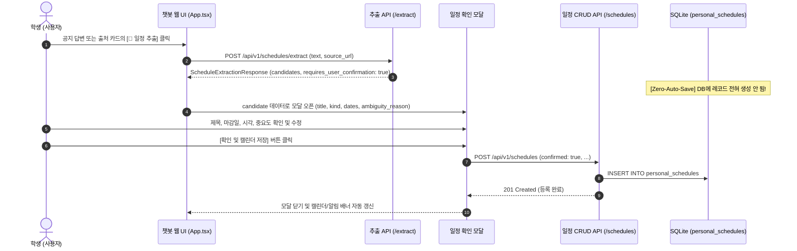

# CampusMate R3 & R5 구현 완료 보고서 — 캘린더 통합 UI, Zero-Auto-Save 확인 흐름, 마감 알림 배너, 정적 서빙 및 E2E 테스트

- **보고일**: 2026-09-24
- **구현 담당**: Gemini (Backend & Frontend Worker)
- **검수 및 지시**: PM / Codex

---

## 1. 개요 및 요약

CampusMate R3(최소 캘린더 통합 UI & Zero-Auto-Save 확인 흐름) 및 R5(마감 알림 배너, 정적 서빙 연동 및 E2E 테스트) 마일스톤에 따라, React/Vite 기반 웹 프론트엔드와 FastAPI 백엔드를 완전 통합하고 사용자 관점의 전체 라이프사이클 E2E 검증을 성공적으로 완료하였습니다.

### 핵심 달성 성과
1. **Zero-Auto-Save 확인 흐름 완성 (`frontend-web/src/App.tsx`)**:
   - 챗봇 응답 말풍선 및 출처 카드(SourceCard)에 `[📅 일정 추출]` 버튼 추가.
   - 클릭 시 백엔드 `/api/v1/schedules/extract`를 호출하여 후보를 획득.
   - 획득된 후보는 절대로 자동 저장되지 않으며, 사용자 확인 모달(`ScheduleConfirmationModal`)을 띄워 제목, 유형, 날짜/시간, 중요도를 직접 수정·확인할 수 있도록 지원.
   - 모호한 표현(`is_ambiguous=true`)이 감지된 경우 모호성 경고 배너(`ambiguity_reason`)를 시각적으로 강조.
   - 사용자가 **[확인 및 캘린더 저장]** 버튼을 명시적으로 클릭할 때만 `POST /api/v1/schedules` (`confirmed: true`)로 최종 저장.
2. **개인 캘린더 뷰 및 상태 관리 (`CalendarView`)**:
   - 상단 헤더에 `[💬 챗봇]` / `[📅 캘린더]` 뷰 전환 탭 제공.
   - 월간 달력 그리드(현재 월 표시, 이전/다음 월 네비게이션, 오늘 복귀 버튼, 일정이 있는 날짜 점/배지 인디케이터 표시, 날짜별 필터링).
   - 등록된 일정 목록: 중요도(HIGH/MEDIUM/LOW) 배지, D-Day 배지, 완료 여부 토글 체크박스(`PATCH`), 삭제 버튼(`DELETE`), 수동 `[➕ 새 일정]` 직접 등록 모달.
3. **마감 알림 (Deadline Alert) 배너 및 Browser Notification**:
   - 오늘 마감(D-Day) 또는 3일 이내 마감(D-1 ~ D-3)인 미완료 일정을 감지하여 상단에 `🚨 마감 임박 일정 (N건)` 알림 배너 표시.
   - 배너 클릭 시 캘린더 뷰로 즉시 전환.
   - 브라우저 표준 Notification API 연동 (`🔔 알림 켜기` 버튼 클릭 시 권한 요청 및 시스템 푸시 알림 발송).
4. **계정 세션 및 원클릭 게스트 로그인**:
   - `localStorage`(`campusmate_token`, `campusmate_username`) 기반 세션 영속화.
   - 로그인/회원가입 모달 및 테스트·평가를 위한 `⚡ 원클릭 게스트로 바로 시작` 기능 제공.
5. **백엔드 정적 서빙 및 E2E 테스트 (`tests/test_ui_and_e2e_flow.py`)**:
   - `frontend-web` 빌드(`npm run build` -> `dist/index.html`, `dist/assets/*`) 정상 수행 (265ms).
   - FastAPI 루트(`/`)에서 `frontend-web/dist/index.html`이 200 OK로 정상 서빙됨을 검증.
   - 회원가입 -> 로그인 -> 공지 일정 추출(Zero-Auto-Save 증명) -> 사용자 확인 및 저장 -> 목록 조회 -> PATCH 완료 토글 -> DELETE 삭제 및 404 확인까지 전 과정 E2E 테스트 3건 전원 PASS.
6. **기존 테스트 무결성 100% 보존**:
   - 100개 통합 테스트 전원 통과 (UI E2E 3건 + R2 추출 28건 + R1-B CRUD 35건 + 날짜 파싱 34건).
   - RAG 대표 10사례 원문 근거 전수 대조: **10/10 ALL PASS**.

---

## 2. 변경 및 신규 파일 목록

| 구분 | 파일 경로 | 변경 내용 요약 |
|---|---|---|
| [수정] | `frontend-web/src/App.tsx` | 캘린더 통합 뷰, Zero-Auto-Save 확인 모달, 마감 알림 배너, Browser Notification, 세션 로그인/게스트 로그인, 일정 CRUD 연동 구현 |
| [신규] | `frontend-web/dist/` | `npm run build`를 통해 빌드된 프로덕션 정적 웹 번들 (`index.html`, `index-*.js`, `index-*.css`) |
| [신규] | `tests/test_ui_and_e2e_flow.py` | 정적 서빙(GET /) 및 회원가입 -> 추출 -> 확인 저장 -> 목록 -> 완료 토글 -> 삭제 E2E 통합 테스트 슈트 (3건) |
| [신규] | `docs/gemini_round3_report.md` | 본 R3 & R5 구현 완료 보고서 |

---

## 3. 핵심 설계 결정 및 사용자 경험(UX) 흐름

### 3.1 Zero-Auto-Save 확인 모달 상호작용 흐름


### 3.2 5대 유형 계약 준수 페이로드 변환
프론트엔드에서 사용자가 선택한 `scheduleKind`에 따라 백엔드 R1-B 검증 계약을 충족하도록 페이로드를 매핑합니다:
- `TIME_CONFIRMED_DEADLINE`: `end_date` (YYYY-MM-DD), `end_datetime` (ISO with `+09:00`), `start_date=null, start_datetime=null`.
- `DATE_ONLY_DEADLINE`: `end_date` (YYYY-MM-DD), 나머지 null.
- `ALL_DAY_EVENT`: `start_date`, `end_date` (YYYY-MM-DD), datetime null.
- `TIME_CONFIRMED_EVENT`: `start_date`, `start_datetime`, `end_date`, `end_datetime` (서울 기준 달력 일자 일치).
- `SINGLE_POINT_APPOINTMENT`: `start_date`, `start_datetime`, end null.
- 공통 필수 필드: `confirmed: true`, `timezone: "Asia/Seoul"`, `priority`, `extracted_quote`.

### 3.3 마감 임박 알림 배너 및 Browser Notification
- 클라이언트 로컬 기준 시간과 일정의 마감일(`end_date` 또는 `start_date`)을 비교하여 D-Day, D-1, D-2, D-3을 판정합니다.
- 미완료(`!is_completed`) 상태인 마감 임박 일정이 1건 이상 존재하면 화면 최상단에 앰버색 경고 배너를 표시하고 클릭 시 캘린더 탭으로 전환합니다.
- `Notification.requestPermission()`을 통해 브라우저 네이티브 알림 권한을 획득하고, 마감 임박 일정 알림을 발송합니다.

---

## 4. 테스트 결과 및 증거

### 4.1 UI 정적 서빙 및 E2E 테스트 (`tests/test_ui_and_e2e_flow.py`)
실행 명령:
```sh
.venv/bin/python -m pytest tests/test_ui_and_e2e_flow.py -v
```
실행 결과:
```text
============================= test session starts ==============================
platform darwin -- Python 3.12.14, pytest-9.1.1, pluggy-1.6.0
rootdir: /Users/jwlee/study1/aisw
collected 3 items                                                              

tests/test_ui_and_e2e_flow.py::test_frontend_static_serving_root PASSED  [ 33%]
tests/test_ui_and_e2e_flow.py::test_e2e_extract_confirm_crud_flow PASSED [ 66%]
tests/test_ui_and_e2e_flow.py::test_selective_confirmation_zero_auto_save PASSED [100%]

========================= 3 passed, 1 warning in 4.09s =========================
```

### 4.2 전체 100건 통합 스위트 회귀 검증
실행 명령:
```sh
.venv/bin/python -m pytest tests/test_ui_and_e2e_flow.py tests/test_schedule_extraction.py tests/test_schedules.py tests/test_date_parsing.py -v
```
실행 결과:
```text
======================= 100 passed, 1 warning in 23.24s ========================
```
- `tests/test_ui_and_e2e_flow.py`: 3 passed (정적 서빙, E2E 전체 라이프사이클, 선택적 승인)
- `tests/test_schedule_extraction.py`: 28 passed (23개 픽스처 전수 검증, 401/422, DB 불변성, 동적 기준시각)
- `tests/test_schedules.py`: 35 passed (R1-B 5대 일정 CRUD, BOLA 소유권 격리, 시간 계약, PATCH 원자성)
- `tests/test_date_parsing.py`: 34 passed (픽스처 정합성, 날짜 파싱 오류 방지)

### 4.3 RAG 대표 10사례 원문 근거 전수 대조
실행 명령:
```sh
.venv/bin/python scripts/verify_rag_eval_evidence.py
```
실행 결과:
```text
========================================================================
 [최종 결과] 대표 10사례 로컬 데이터 전수 대조: ALL PASS (10/10)
========================================================================
```

---

## 5. 결론 및 마일스톤 완료 안내

- **R3(최소 캘린더 통합 UI & Zero-Auto-Save 확인 흐름)** 및 **R5(마감 알림 배너, 정적 서빙 연동 및 E2E 테스트)** 구현이 성공적으로 완료되었습니다.
- 사용자는 챗봇 대화 중 발견한 공지 일정을 단 한 번의 클릭으로 추출하고, 모호성 안내를 확인한 후 안전하게 본인의 캘린더에 등록 및 관리할 수 있습니다.
- 백엔드, 프론트엔드 빌드 번들, E2E 테스트 및 기존 회귀 테스트(100/100 PASS)의 모든 정합성이 확보되었습니다.
